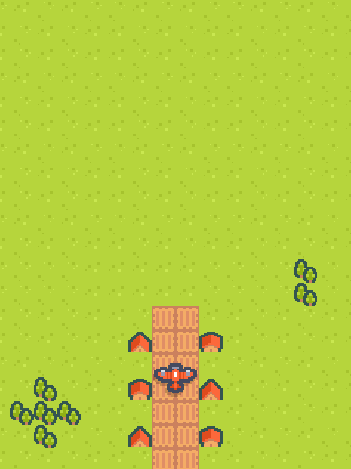
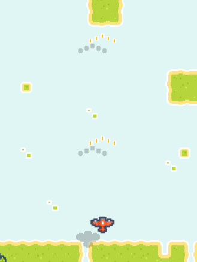

# 2D Scrolling Shooter V 0.5

I started developing a 2D vertical scrolling shooter game similar to 1942. The goal is to implement all the main features by February 10th. Currently, the game is not functioning.

## Screenshots

## Version History
**V 0.5 - (2025-02-08)**
- Added semi transparent layer to background tilemap
- Implemented player gun upgrade feature

**V 0.4 - (2025-02-07)**
- Now player plane can fire bullets
- Implemented bullet object pool using Unity's ObjectPool

**V 0.3 - (2025-02-06)**
- Added basic particle effect for plane launch sequence

**V 0.2 - (2025-02-05)**
- Added rotation along the Z-axis during horizontal movement
- Testing background scrolling
- Added player plane launch sequence
- Added shadow for the player plane

**V 0.1 - (2025-02-03)**
- Project setup
- Testing assets
