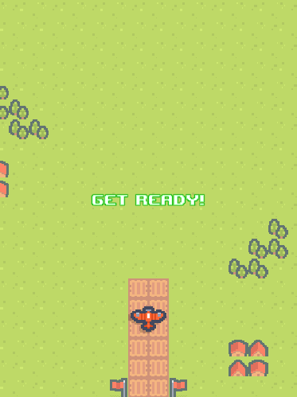
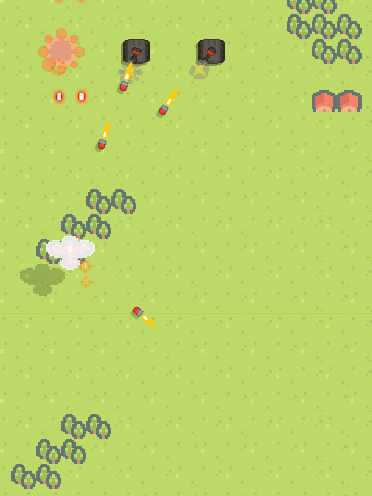

# 2D Scrolling Shooter V 2.54

I started developing a 2D vertical scrolling shooter game similar to 1942. The goal is to implement all the main features by February 10th. Currently, the game is not functioning.

## Screenshots

## Version History
**V 2.54 - (2025-03-10)**
- Implemented player crash effect
- Implemented player respawn

**V 2.53 - (2025-03-09)**
- Started testing the player dead(explosion) effect

**V 2.52 - (2025-03-08)**
- Scraped player shield concept
- Started testing player armor

**V 2.51 - (2025-03-06)**
- Started testing player shield

**V 2.5 - (2025-03-05)**
- Implemented blinking "get ready" message

**V 2.49 - (2025-03-04)**
- Replaced player projectile with color beams
- Started testing "get ready" message

**V 2.48 - (2025-03-03)**
- Added Enemy tank explostion effect
- Crator created when enemy tank destoried
- Added player plane flash effect when hit with enemy projectiles

**V 2.47 - (2025-03-02)**
- Started testing enemy tank destroy routine

**V 2.46 - (2025-03-01)**
- Added enemy tank flash effect when hit with player bullet

**V 2.45 - (2025-02-28)**
- Player's bullets now collide with enemies

**V 2.4 - (2025-02-27)**
- Generic object pool has been implemented
- All object pool has been converted to generic pool
- The tank's cannon now collides with the player

**V 2.2 - (2025-02-26)**
- Tank's waypoint routine finished
- No tank will turn smoothly between each waypoint

**V 2.19 - (2025-02-25)**
- Almost finished tank's waypoint routine

**V 2.15 - (2025-02-24)**
- Adjusted the turret's rotation smoothly before firing the projectile
- Added muzzle flash object pool
- Added rocket flame effect

**V 2.0 - (2025-02-23)**
- Fixed to use Collider2D instead of SpriteRenderer for the test to prevent the player from going off-screen
- Modified to ensure smooth rotation of the player when turning left and right

**V 1.9 - (2025-02-22)**
- Replaced WhiteLayer from tilemap to simple sprite
- Now the player can't go outsize the screen

**V 1.85 - (2025-02-21)**
- Now the player can fire the weapon continuously by holding down the attack key (Space)
- Added grow and shrink animation to muzzle flash effect for tank

**V 1.7 - (2025-02-20)**
- Added muzzle flash effect for tank

**V 1.6 - (2025-02-19)**
- Added an effect that changes the shape of the turret when the tank fires a shell

**V 1.5 - (2025-02-18)**
- Now tanks don't share lifecycle with background tileset.

**V 1.4 - (2025-02-18)**
- Simplified the initialization of the tank's state pattern using dependency injection

**V 1.3 - (2025-02-17)**
- Started implementing tank's movement routine

**V 1.1 - (2025-02-15)**
- Implemented tank canon pool manager

**V 1.0 - (2025-02-14)**
- Modified the fields of the StateManager's child classes to be accessible from individual state classes
- Now tank can shoot canon correctly

**V 0.9 - (2025-02-13)**
- Applied the state pattern to tank enemy
- Began testing tank's attack routine

**V 0.8 - (2025-02-11)**
- Started implementing first enemy type(normal tank)

**V 0.7 - (2025-02-10)**
- Fixed tilemap scrolling artifact issue

**V 0.6 - (2025-02-09)**
- Implemented infinite scrolling using 16x20 timemap sets

**V 0.5 - (2025-02-08)**
- Added semi transparent layer to background tilemap
- Implemented player gun upgrade feature

**V 0.4 - (2025-02-07)**
- Now player plane can fire bullets
- Implemented bullet object pool using Unity's ObjectPool

**V 0.3 - (2025-02-06)**
- Added basic particle effect for plane launch sequence

**V 0.2 - (2025-02-05)**
- Added rotation along the Z-axis during horizontal movement
- Testing background scrolling
- Added player plane launch sequence
- Added shadow for the player plane

**V 0.1 - (2025-02-03)**
- Project setup
- Testing assets
