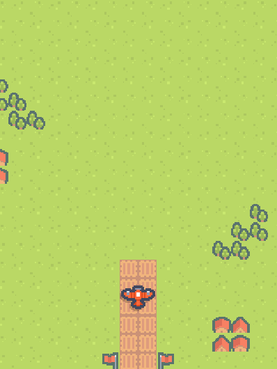
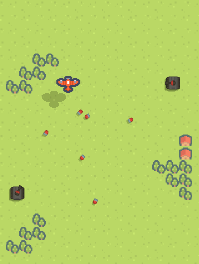

# 2D Scrolling Shooter V 1.6

I started developing a 2D vertical scrolling shooter game similar to 1942. The goal is to implement all the main features by February 10th. Currently, the game is not functioning.

## Screenshots

## Version History
**V 1.6 - (2025-02-19)**
- Added an effect that changes the shape of the turret when the tank fires a shell

**V 1.5 - (2025-02-18)**
- Now tanks don't share lifecycle with background tileset.

**V 1.4 - (2025-02-18)**
- Simplified the initialization of the tank's state pattern using dependency injection

**V 1.3 - (2025-02-17)**
- Started implementing tank's movement routine

**V 1.1 - (2025-02-15)**
- Implemented tank canon pool manager

**V 1.0 - (2025-02-14)**
- Modified the fields of the StateManager's child classes to be accessible from individual state classes
- Now tank can shoot canon correctly

**V 0.9 - (2025-02-13)**
- Applied the state pattern to tank enemy
- Began testing tank's attack routine

**V 0.8 - (2025-02-11)**
- Started implementing first enemy type(normal tank)

**V 0.7 - (2025-02-10)**
- Fixed tilemap scrolling artifact issue

**V 0.6 - (2025-02-09)**
- Implemented infinite scrolling using 16x20 timemap sets

**V 0.5 - (2025-02-08)**
- Added semi transparent layer to background tilemap
- Implemented player gun upgrade feature

**V 0.4 - (2025-02-07)**
- Now player plane can fire bullets
- Implemented bullet object pool using Unity's ObjectPool

**V 0.3 - (2025-02-06)**
- Added basic particle effect for plane launch sequence

**V 0.2 - (2025-02-05)**
- Added rotation along the Z-axis during horizontal movement
- Testing background scrolling
- Added player plane launch sequence
- Added shadow for the player plane

**V 0.1 - (2025-02-03)**
- Project setup
- Testing assets
